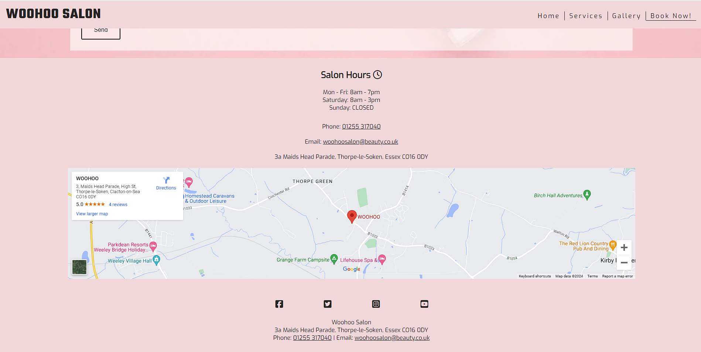

# Woohoo Salon
(by Robyn Soar)

Woohoo Salon is a website aimed at the 16+ audience looking to have high quality nail services. This website allows users to gather insight into the nail salon business and the services they provide. With information about the salon itself, the services they provide with pricing, a gallery of previous finished services to convince the user to trust in the quality and professionalism of the Woohoo Salon business, and lastly a contact form to communicate with the staff at Woohoo Salon for any queries, including booking appointments. View the live site [here](https://robynsoar.github.io/woohoo-salon/) 


## Table of Contents

- [Features](#features)
    - [Site Wide](#sitewide)
    - [Landing Page](#landing-page)
    - [Services Page](#services-page)
    - [Gallery Page](#gallery-page)
    - [Form Page](#form-page)
    - [Existing Features](#existing-features)
    - [Features Left to Impliment](#features-left-to-impliment)
- [Design](#design)
    - [Wireframes](#wireframes)
    - [Colour Palette](#colour-palette)
    - [Google Fonts](#google-fonts)
    - [Technologies Used](#technologies-used)
- [Testing](#testing)
    - [Responsiveness](#responsiveness)
    - [Accessibility](#accessibility)
    - [Lighthouse Testing](#lighthouse-testing)
    - [Fuctional Testing](#functional-testing)
    - [Validator Testing](#validator-testing)
- [Deployment](#deployment)
    - [Version Control](#version-control)
    - [Deployment to GitHub Pages](#deployment-to-github-pages)
    - [Clone the Repository Code Locally](#clone-the-repository-code-locally)
- [Credits](#credits)
    - [Inspired Code](#inspired-code)
    - [Walkthrough Code](#walkthrough-code)
    - [Used Code](#used-code)
    - [Media](#media)
    - [Acknowledgements](#acknowledgements)
- [Author](#author)

## Features

The Website is made up of 6 pages, a Home page, Services page, Gallery page, Book Now page, a thank you page upon successful completion of the contact form, and a 404 error page incase of a broken link, of which will not be seen by the user unless an error occurs.

### Site Wide

- Logo
    - Contains a link to the Home page from any other page.


- Navigation Menu
    - Contains links to the Home, Services, Gallery and Book Now pages and will be availble to the user at all times and responsive on all devices.


- Footer
    - Contains links as icons to social media websites that will open in new tabs. The icons respond when hovered over on laptop screens and larger and also contain aria-labels to aid with accessibility for anyone visually impared who may be using a screen reader.
    - The second part of the footer contains the phone, email and address of the business. The phone contact information has a link taking the user to their mobile devices numberpad, and the email contact information has a link taking the user to their mailing system on mobile, tablet or desktop devices.


- Favicon
    - The site wite favicon show an easily recognisable nail polish bottle, in a colour matching the colour palette of the Website.
    - This provides an image in the tabs header to allow the user to easily identify the Website if they have multiple websites open at once.


### Landing Page

- Hero image
    - On entering the Website, users will be greeted with a large hero image, giving the first impression of a serene and clean enviroment.
    - A call-to-action button within the hero image is visable on all devices and will take users to the contact form on the 'Book Now!' page to get in contact with the staff at Woohoo Salon.
    - Content below the hero image is visable on devices from mobile to desktop, immediately confirming the site as a nail salon.


- Nail care information
    - Information about the benefits of nail care can be seen when users scroll on the webpage.
    - This will entice users to get their nails done for other purposes than simply for style.

- About the Woohoo Salon business
    - Information about the business can be seen when users scroll on the webpage.
    - This will further entice users to get their nails done at Woohoo Salon.

- Testimonials
    - Three sections of text can be seen, showing reviews from customers of the business.


### Services Page

- Service page
    - Clear and simple information about the services and the prices of each treatment.
    - The information is presented in a clear manner which allows the users to know exactly what service they would be getting.


### Gallery Page

- Gallery
    - The gallery will provide users with photos of the finished treatments on real customers.
    - This will allow users that are interested to see what talents the business have to offer and what kind of quality the user can expect.


### Form Page

- Contact form
    - The contact form allows user to contact the staff at the Woohoo Salon business. The form consists of the following fields and attributes.
        - First name (type=text, required)
        - Last name (type=text, required)
        - Email address (type=email, required)
        - Message (type=text, required)
    - On successful submission of the contact form, the user will be navigated to thankyou.html displaying a successful message thanking the user.


- Salon Hours
    - Information of the business hours is clearly listed for new and frequent users of the site.

- Contact details
    - The business telephone number when clicked on will take the user to their mobile device numberpad, making it easier for the user to contact the business.
    - The business email address when clicked on will take the user to their devices mailing app, making it easier for the user to contact the business.

- Map
    - A responsive and interactive Google Maps is embedded under the address of the salon business.
    - This gives the user information on the business location, and enables quick access to Google Maps for ease in finding the route to the location.




- 404 Error page
    - A 404 Error page has been included incase there are any issues with bug or typos within the URL, causing the Website to not work as intended.
    - This page will have minimal detail that carries over the style of the Website to indicate to the user that they haven't left the site.
    - A clear 'Back to Homepage' button will navigate users to the landing page, giving them an easy way to get back onto the site and increasing the chances of the user staying on the site despite the error.


### Existing Features

- Responsive and intuitive design site wide
- Call-to-action button directing to contact with business
- Responsive gallery
- Contact form and success page
- 404 Error page with clear navigation back to site

### Features Left to Implement 

- Add a reviews section for customers to leave their own feedback directly to the website.
- Adapt the section for Testimonials to have alternating reviews from customers that automatically update when new reviews are submitted.
- Ability for customers to sign-in to their own account with the salon, this will be useful to users to update their contact information.
- Ability for staff members to sign-in to a business account with the salon, this will be useful to keep customer records and notes on the customers e.g. favourite polish colours, nail type, artificial nail tip sizes, relevant medical records, etc.
- Ability for the business to easily alter the services they provide and prices.
- Ability for the business to easily upload new images to the site.
- Embed a tailor-made or external booking system into the site to automate and increase in-salon traffic, making booking an appointment easier for customers and staff.

[Return to Table of Contents](#table-of-contents)

## Design

### Wireframes

__Landing page__

- Desktop


- Mobile


__Services page__

- Desktop


- Mobile


__Gallery page__

- Desktop


- Mobile


__Form page__

- Desktop


- Mobile


__Successful form submission page__

- Desktop


- Mobile


### Colour Palette

The following colour palette was used throughout the Website and provided clean contrast between elements:

- #FEF6F6 - Light accent
- #F2D7DA - Main background colour site wide
- #E46877 - Main contrast accent for hover links
- #3A3A3A - Dark accent
- #252525 - Main logo/text/border colour site wide


### Google Fonts

[Google Fonts](https://fonts.google.com/) was used to import fonts for the Website, these include:

- "Teko", sans-serif: Used for the Website logo
- "Exo", sans-serif: Used for all other text content site wide

### Technologies Used

- HTML
    - The main structure of the Website was developed using HTML as the main language.

- CSS
    - The Website was styles using custom CSS in an external file.

- GitHub
    - Source code is hosted on GitHub and deployed using Git Pages.

- Git
    - Used for development of the Website as well as commit and pushing code throughout.

- [Favicon.io](https://favicon.io/favicon-converter/)
    - Favicon files were created with this favicon converter.

- [FontAwesome](https://fontawesome.com/)
    - Icons were used for social media links in the footer and throughout the sites headings.

- [TinyPNG](https://tinypng.com/)
    - Used TinyPNG to compress image assets to aid in the website running quicker.

- [Pixelied](https://pixelied.com/convert/jpg-converter/jpg-to-webp)
    - Used Pixelied to convert file types of image assets from jpg to webp to aid in the website running quicker.

- Procreate
    - A digital illustration app was used to illustrate the wireframes.

- [Am I Reponsive](https://ui.dev/amiresponsive)
    - Used to show the Website's responsivity across a variety of devices.

- [WebAIM Contrast Checker](https://webaim.org/resources/contrastchecker/)
    - Used to check the colour contrast of the Website for accessibility.

- [Google Fonts](https://fonts.google.com/)
    - Used to import fonts used throughout the Website.

- [Coolors](https://coolors.co/)
    - Colour palette swatches

[Return to Table of Contents](#table-of-contents)

## Testing

### Responsiveness

All pages were tested to ensure responsiveness on screen sizes from 280px (width) on Chrome.

Steps to test:
1. Open Chrome and navigate to [Woohoo Salon](https://robynsoar.github.io/woohoo-salon/)
2. Open the Chrome DevTools (right click on webpage and click 'inspect')
3. Set to 'responsive' and decrease width to 280px
4. Set the zoom to 50%
5. Click and drag the responsive window to maximum width

Expected:

Website is responsive on all screen sizes and no images are pixelated or warped. No horizontal scroll is present. No elements overlap.

Actual:

Website behaved as expected.

Website was also opened on the following devices and no responsive issues were seen:

- Samsung S22 Ultra
- Apple Ipad Pro

### Accessibility

Throughout the developement of the site and for final testing of the deployed Website [Wave Accessibility](https://wave.webaim.org/) tool was used to test for any accessbility aid.

Testing was focused to ensure the following criteria were met:

- Colour contrasts meet a minimum ratio as specified in [WCAG 2.1 Contrast Guidelines](https://www.w3.org/WAI/WCAG21/Understanding/contrast-minimum.html).
- Heading levels are not missed or skipped to ensure importance of content is relayed correctly to the end user.
- All content is contained within landmarks to ensure ease of use for assistive technology, allowing the user to navigate by page regions.
- All non textual content has alt text, labels or titles so they can be read out to screen readers.
- HTML page lang attribute has been set.
- Aria properties have been implemented correctly.
- WCAG 2.1 Coding best practices have been followed.
- Manual tests performed to ensure the website was accessible via keyboard, no issues were found.

### Lighthouse Testing

__Landing page__

- Desktop


- Mobile


__Services page__

- Desktop


- Mobile


__Gallery page__

- Desktop


- Mobile


__Form page__

- Desktop


- Mobile


__Successful form submission page__

- Desktop


- Mobile


### Fuctional Testing

__Navigation Links__

Testing was performed to ensure all navigation links on the respective pages, navigated to the correct pages as per design. This was done by clicking on the navigation links on each page.

| Navigation Link | Page to Load    |
| --------------- | --------------- |
| Woohoo Logo     | index.html      |
| Home            | index.html      |
| Services        | services.html   |
| Gallery         | gallery.html    |
| Book Now!       | booknow.html    |
| Book Now! (CTA) | booknow.html    |

Links on all pages navigated to the correct pages as exptected.

__Form Testing__

The form on the home page was tested to ensure it functioned as expected when correct data was input and when incorrect data was input. The following test scenarios were covered:

_Scenario One - Correct Inputs_

Steps to test:

1. Navigate to [Woohoo Salon - Booknow Page](https://robynsoar.github.io/woohoo-salon/booknow.html)
2. Scroll down to the form and input the following data:
   - First Name: Jane
   - Last Name: Doe
   - Email: doe.jane@test.com
   - Comment: This is a test.
3. Click Submit
4. User should be redirected to thankyou.html confirmation page

Expected:

Form submits with no warnings or errors and user is redirected to thankyou.html confirmation page.

Actual:

Website behaved as expected with no errors or warnings and redirected to thankyou.html.

_Scenario Two - Missing Required Field First Name_

Steps to test:

1. Navigate to [Woohoo Salon - Booknow Page](https://robynsoar.github.io/woohoo-salon/booknow.html)
2. Scroll down to the form and input the following data:
   - First Name:
   - Last Name: Doe
   - Email: doe.jane@test.com
   - Comment: This is a test.
3. Click Submit

Expected:

The form does not submit and an Error is displayed to tell the user that the field is required.

Actual:

Website behaved as expected, error message was displayed and the form did not submit.

_Scenario Three - Missing Required Field Last Name_

Steps to test:

1. Navigate to [Woohoo Salon - Booknow Page](https://robynsoar.github.io/woohoo-salon/booknow.html)
2. Scroll down to the form and input the following data:
   - First Name: Jane
   - Last Name:
   - Email: doe.jane@test.com
   - Comment: This is a test.
3. Click Submit

Expected:

The form does not submit and an Error is displayed to tell the user that the field is required.

Actual:

Website behaved as expected, error message was displayed and the form did not submit.

_Scenario Four - Missing Required Field Email_

Steps to test:

1. Navigate to [Woohoo Salon - Booknow Page](https://robynsoar.github.io/woohoo-salon/booknow.html)
2. Scroll down to the form and input the following data:
   - First Name: Jane
   - Last Name: Doe
   - Email:
   - Comment: This is a test.
3. Click Submit

Expected:

The form does not submit and an Error is displayed to tell the user that the field is required.

Actual:

Website behaved as expected, error message was displayed and the form did not submit.

_Scenario Six - Incorrect email format_

Steps to test:

1. Navigate to [Woohoo Salon - Booknow Page](https://robynsoar.github.io/woohoo-salon/booknow.html)
2. Scroll down to the form and input the following data:
   - First Name: Jane
   - Last Name: Doe
   - Email: doe.janetest.com
   - Comment: This is a test.
3. Click Submit

Expected:

The form does not submit and an Error is displayed to tell the user that a valid email is required and the format it should be in.

Actual:

Website behaved as expected, error message was displayed and the form did not submit.

__Footer Social Media Icons / Links__

Testing was performed on the Font Awesome Social Media icons in the footer to ensure that each one opened in a new tab and that each one had a hover affect of the blush pink accent color.

Each item opened a new tab when clicked as expected and correct hover colour was present.

__Footer Contact Information__

Testing was performed on the phone number in the contact information section of the footer to ensure behaviour was as expected.

_Steps to test Telephone Number_

1. Navigate to [Woohoo Salon - Home Page](https://robynsoar.github.io/woohoo-salon/index.html)
2. Click the phone number in the footer (01255 317040)

Expected:

A window is opened asking which application you'd like to open in.

Actual:

Behavior was as expected and the window presented me with the following option:

- Open in Skype (On desktop)
- Opened mobile device numberpad with phone number input (On mobile device)

_Steps to test Email Link_

1. Navigate to [Woohoo Salon - Home Page](https://robynsoar.github.io/woohoo-salon/index.html)
2. Click the email address in the footer (woohoosalon@beauty.co.uk)

Expected:

A windows popup is displayed asking what application you would like to send a mail from or your default email application is opened.

Actual:

Behavior was as expected and my GMail application was selected as default, opening the Gmail application showed the email address ready to send an email to the target address.

### Validator Testing

- HTML
    - No errors were returned when checking all HTML pages through the [W3C Validator](https://validator.w3.org/)

 Landing Page

 

 Services Page

 

 Gallery Page

 

 Form Page

 

 Successful form submission Page

 

- CSS
    - No errors were returned when checking CSS through the [W3C CSS Validation](https://jigsaw.w3.org/css-validator/)


### Unfixed Bugs

No bugs to report that haven't already been fixed. Continous testing in the future will be carried out.

<a name="table-of-contents">Return to Table of Contents</a>

## Deployment

### Version Control

The site was created using the Git editor and pushed to GitHUb to the remote repository 'woohoo-salon'

The following git commands were used throughout development to push code to the remote repository:

```git add <file>``` - This command was used to add the file(s) to the staging area before they are commited.

```git commit -m "commit message"``` - This command was used to commit changes to the local repository queue ready to be pushed.

```git push``` - This command was used to push all committed code to the remote repository 'woohoo-salon' on GitHub.

### Deployment to GitHub Pages

The site was deployed to GitHub Pages. The steps to deploy are as follows:
1. In the GitHub repository, navigate to the 'Settings' tab
2. From the menu called 'Code and automation' on the left, select 'Pages'
3. From the Default branch drop down menu, select 'Main'
4. Click 'Save'
5. A live link will be displayed in a green banner when published succesfully.

The live link to 'woohoo-salon' can be found here - [Woohoo Salon Live](https://robynsoar.github.io/woohoo-salon/)

### Clone the Repository Code Locally

Navigate to the GitHub Repository you want to clone to use locally:
1. Click on the code drop down button
2. Click on HTTPS
3. Copy the repository link to the clipboard
4. Open your IDE of choice (Git must be installed for the next steps)
5. Type git close copied-git-url into the IDE terminal

The project will now of been cloned on your local machine for use.

[Return to Table of Contents](#table-of-contents)

## Credits

### Inspired Code

- [Taco Travels - Gareth McGirr](https://github.com/Gareth-McGirr/tacos-travels/blob/main/README.md)
    - Woohoo Salon's README.md layout and contents was inspired by this README.
- [Writing a High Quality README! - Blog](https://dev.to/coderarchive/writing-a-high-quality-readme-1k3j)
    - Woohoo Salon's README.md layout and contents was also inspired by this README to confirm I had the correct content for a good quality README.

- [Love Running - Code Institute](https://learn.codeinstitute.net/courses/course-v1:CodeInstitute+LRFX101+2023_Q2/courseware/e805068059af42af87681032aa64053f/1da6ad13213740f1855a51d30a2375b1/)
    - Inpiration for sections of basic code.

### Walkthrough Code

- [Pee-Aye Creative](https://www.youtube.com/watch?v=NsUZZ7gHIuA)
    - Divided navbar styling was created with the walkthrough from this video.

- [HTML Dog](https://www.htmldog.com/techniques/404/)
    - This walkthrough was used to aid in creation of the 404 Error page.

### Used Code

- [Medium - Web Accessibility Tip](https://medium.com/web-accessibility-tips-tricks-and-techniques-for/web-accessibility-tip-visually-hidden-text-for-screen-readers-a52d954d9711#:~:text=sr%2Donly%20declaration%20block%20does,invisible%20to%20the%20human%20eye)
    - Code used to fix lack of accessbility with screen readers on mobile devices that show the dropdown menu.

- [web.dev](https://web.dev/articles/optimize-lcp?utm_source=lighthouse&utm_medium=lr#optimize_when_the_resource_is_discovered)
    - Code used to preload the LCP images with high fetchpriority so they load with the stylesheet. Aiding in better site performance.

### Media

- [Pexels](https://www.pexels.com/)
    - Free stock images from Pexels was used site wide.

- [Icons8](https://icons8.com/)
    - Favicon image

- [Google Maps](https://www.google.com/maps)
    - Embeded Google Maps was created with code directly from Google Maps' embed tool.

### Acknowledgements

A big thank you to my wonderful friends and classmates within the Code Institute Slack community, for always being there with great morale, guidance and great team spirit.

Another Thank you to my wonderful mentor [Gareth McGirr](https://github.com/Gareth-McGirr), for being comfortable to talk with, knowledgable and providing priceless guidance throughout the project.

[Return to Table of Contents](#table-of-contents)

## Author

Robyn Soar 
robyn999@hotmail.co.uk