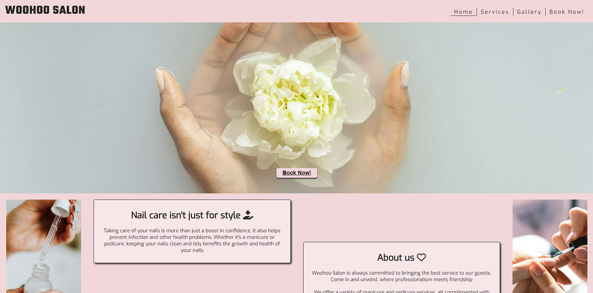

# Woohoo Salon

Woohoo Salon is a website aimed at the 16+ audience looking to have high quality nail services. This website allows users to gather insight into the nail salon business and the services they provide. With information about the salon itself, the services they provide with pricing, a gallery of previous finished services to convince the user to trust in the quality and professionalism of the Woohoo Salon business, and lastly a contact form to communicate with the staff at Woohoo Salon for any queries, including booking appointments. View the live site [here](https://robynsoar.github.io/woohoo-salon/) 

## Table of Contents

- <a name="features">Features</a>
    - <a name="sitewide">Site Wide</a>
    - <a name="landing-page">Landing Page</a>
    - <a name="services-page">Services Page</a>
    - <a name="gallery-page">Gallery Page</a>
    - <a name="form-page">Form Page</a>
    - <a name="existing-features">Existing Features</a>
    - <a name="features-left-to-impliment">Features Left to Impliment</a>
- <a name="design">Design</a>
    - <a name="wireframes">Wireframes</a>
    - <a name="technologies-used">Technologies Used</a>
- <a name="testing">Testing</a>
    - <a name="responsiveness">Responsiveness</a>
    - <a name="accessibility">Accessibility</a>
    - <a name="lighthouse-testing">Lighthouse Testing</a>
    - <a name="functional-testing">Fuctional Testing</a>
    - <a name="validator-testing">Validator Testing</a>
- <a name="deployment">Deployment</a>
    - <a name="version-control">Version Control</a>
- <a name="credits">Credits</a>
    - <a name="media">Media</a>
- <a name="author">Author</a>

## Features

The Website is made up of 6 pages, a Home page, Services page, Gallery page, Book Now page, a thank you page upon successful completion of the contact form, and a 404 error page incase of a broken link, of which will not be seen by the user unless an error occurs.

### Site Wide

- Logo
    - Contains a link to the Home page from any other page.

- Navigation Menu
    - Contains links to the Home, Services, Gallery and Book Now pages and will be availble to the user at all times and responsive on all devices.

- Footer
    - Contains links as icons to social media websites that will open in new tabs. The icons respond when hovered over on laptop screens and larger and also contain aria-labels to aid with accessibility for anyone visually impared who may be using a screen reader.
    - The second part of the footer contains the phone, email and address of the business. The phone contact information has a link taking the user to their mobile devices numberpad, and the email contact information has a link taking the user to their mailing system on mobile, tablet or desktop devices.

- Favicon
    - The site wite favicon show an easily recognisable nail polish bottle, in a colour matching the colour palette of the Website.
    - This provides an image in the tabs header to allow the user to easily identify the Website if they have multiple websites open at once.

### Landing Page

- Hero image
    - On entering the Website, users will be greeted with a large hero image, giving the first impression of a serene and clean enviroment.
    - A call-to-action button within the hero image is visable on all devices and will take users to the contact form on the 'Book Now!' page to get in contact with the staff at Woohoo Salon.
    - Content below the hero image is visable on devices from mobile to desktop, immediately confirming the site as a nail salon.

- Nail care information
    - Information about the benefits of nail care can be seen when users scroll on the webpage.
    - This will entice users to get their nails done for other purposes than simply for style.

- About the Woohoo Salon business
    - Information about the business can be seen when users scroll on the webpage.
    - This will further entice users to get their nails done at Woohoo Salon.

- Testimonials
    - Three sections of text can be seen, showing reviews from customers of the business.

### Services Page

- Service page
    - Clear and simple information about the services and the prices of each treatment.
    - THe information is presented in a clear manner which allows the users to know exactly what service they would be getting.

### Gallery Page

- Gallery
    - The gallery will provide users with photos of the finished treatments on real customers.
    - This will allow users that are interested to see what talents the business have to offer and what kind of quality the user can expect.

### Form Page

### Existing Features

### Features Left to Implement 

<a name="table-of-contents">Return to Table of Contents</a>

## Design

### Wireframes

<!-- Insert Wireframe images/drawings -->

### Technologies Used

- HTML
    - The main structure of the Website was developed using HTML as the main language.

- CSS
    - The Website was styles using custom CSS in an external file.

- GitHub
    - Source code is hosted on GitHub and deployed using Git Pages.

- Git
    - Used for development of the Website as well as commit and pushing code throughout.

- [Favicon.io](https://favicon.io/favicon-converter/)
    - Favicon files were created with this favicon converter.

- [FontAwesome](https://fontawesome.com/)
    - Icons were used for social media links in the footer and throughout the sites headings.

- [TinyPNG](https://tinypng.com/)
    - Used TinyPNG to compress image assets to aid in the website running quicker.

- [Pixelied](https://pixelied.com/convert/jpg-converter/jpg-to-webp)
    - Used Pixelied to convert file types of image assets from jpg to webp to aid in the website running quicker.

- Procreate
    - A digital illustration app was used to illustrate the wireframes.

- [Am I Reponsive](https://ui.dev/amiresponsive)
    - Used to show the Website's responsivity across a variety of devices.

- [WebAIM Contrast Checker](https://webaim.org/resources/contrastchecker/)
    - Used to check the colour contrast of the Website for accessibility.

- [Google Fonts](https://fonts.google.com/)
    - Used to import fonts used throughout the Website.

<a name="table-of-contents">Return to Table of Contents</a>

## Testing

### Responsiveness

### Accessibility

<!-- https://wave.webaim.org/ -->

### Lighthouse Testing

### Fuctional Testing

### Validator Testing

- HTML
<!-- https://validator.w3.org/ -->

- CSS
<!-- https://jigsaw.w3.org/css-validator/ -->

<!-- ### Unfixed Bugs -->

<a name="table-of-contents">Return to Table of Contents</a>

## Deployment

### Version Control

<a name="table-of-contents">Return to Table of Contents</a>

## Credits

- [Taco Travels - Gareth McGirr](https://github.com/Gareth-McGirr/tacos-travels/blob/main/README.md)
    - Woohoo Salon's README.md layout and contents was inspired by this README.
- [Writing a High Quality README! - Blog](https://dev.to/coderarchive/writing-a-high-quality-readme-1k3j)
    - Woohoo Salon's README.md layout and contents was also inspired by this README to confirm I had the correct content for a good quality README.

- [Love Running - Code Institute](https://learn.codeinstitute.net/courses/course-v1:CodeInstitute+LRFX101+2023_Q2/courseware/e805068059af42af87681032aa64053f/1da6ad13213740f1855a51d30a2375b1/)
    - Inpiration for sections of basic code.

- [Pee-Aye Creative](https://www.youtube.com/watch?v=NsUZZ7gHIuA)
    - Divided navbar styling was created with inspiration from this video.

- [HTML Dog](https://www.htmldog.com/techniques/404/)
    - This walkthrough was used to aid in creation of the 404 Error page.

- [Medium - Web Accessibility Tip](https://medium.com/web-accessibility-tips-tricks-and-techniques-for/web-accessibility-tip-visually-hidden-text-for-screen-readers-a52d954d9711#:~:text=sr%2Donly%20declaration%20block%20does,invisible%20to%20the%20human%20eye)
    - Code used to fix lack of accessbility with screen readers on mobile devices that show the dropdown menu.

- [web.dev](https://web.dev/articles/optimize-lcp?utm_source=lighthouse&utm_medium=lr#optimize_when_the_resource_is_discovered)
    - Code used to preload the LCP images with high fetchpriority so they load with the stylesheet. Aiding in better site performance.

### Media

- [Pexels](https://www.pexels.com/)
    - Free stock images from Pexels was used site wide.

- [Icons8](https://icons8.com/)
    - Favicon image

<a name="table-of-contents">Return to Table of Contents</a>

## Author

Robyn Soar 
robyn999@hotmail.co.uk